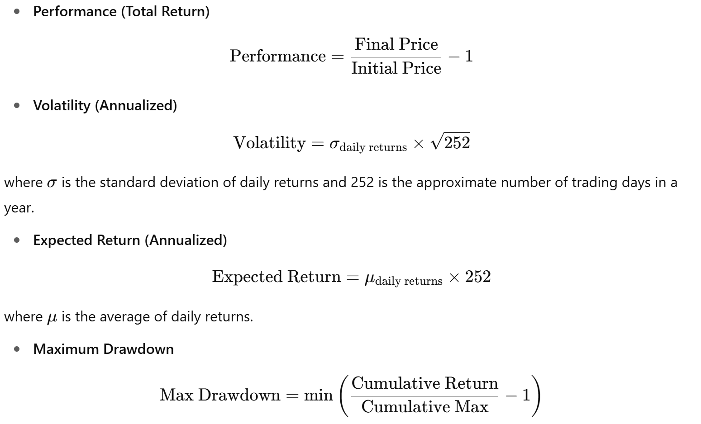

## Context

This project aims to collect and analyze financial data. We have to retrieve the share price of an OPCVM (**ISIN IE0002ZXSH01**) from a public source, then calculate indicators over several periods. The results are then exported to a CSV file. Add some granularity to the data.

- **Data source: Yahoo Finance (https://finance.yahoo.com/quote/WPEA.PA/history/)**

## Project Structure
scraper-opcvm/

├── data/                    
├── src/            
│   ├── data.py           
│   ├── indicators.py       
│   ├── export.py            
│   └── main.py              
├── tests/                   
├── requirements.txt         
├── README.md               
└── .gitignore    

## Installation
Clone the repository:  
```bash
git clone https://github.com/falmata/scraper-opcvm
cd scraper-opcvm
```
Create a virtual environment:
```bash
python -m venv venv
venv\Scripts\activate
```
Install the dependencies:
```bash
pip install -r requirements.txt
```
**Important**: Your version of Python must be greater than 3.7

## Usage
```bash
python scraper-opcvm/src/main.py
```

The script will:

- Fetch historical data for ISIN from Yahoo Finance.
- Compute financial indicators for multiple periods (YTD, 3M, 6M, 1Y, 3Y).
- Export the results to data\ISIN_IE0002ZXSH01_results.csv.
- Open the generated CSV file to view the results.

## Financial Indicators Formulas

